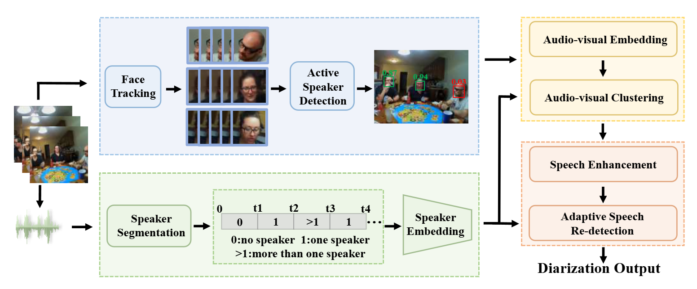

Hi! I'm Yu Haoyuan.

I'm a third year undergraduate student from [HNU of CSEE](http://csee.hnu.edu.cn/), [Hunan University](https://www.hnu.edu.cn/).

I am studying computer courses and have a strong interest in computer vision.

# 🔥 News

- *[December, 2024]*:  🎉 One [ICASSP](https://2025.ieeeicassp.org/) papers have been accepted.

---

# 📄 Publications

    

        
    

    

        <h3>Egocentric Speaker Diarization with Vision-Guided Clustering and Adaptive Speech Re-detection</h3>
        
He Huang, <u>Haoyuan Yu</u>, Daibo Liu, Haowen Chen, Minjie Cai   
        IEEE International Conference on Acoustics, Speech, and Signal Processing (ICASSP), 2025   
        [GitHub](https://github.com/YellowRiver2001/EgoDiarization)   
        

    

---